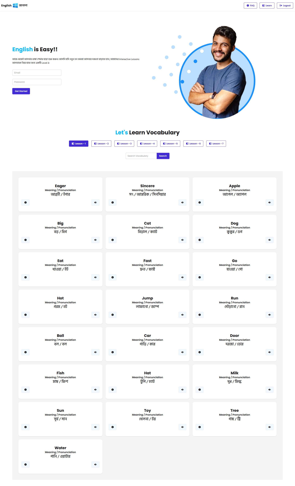

## English  Janala

English Janala is a vocabulary learning web application where users can explore English words by levels, view word details, and improve their language skills interactively.

🔗 Live Website:
https://moonlit-praline-6609ba.netlify.app/

🚀 Features

⚡ View All Levels

📚 Browse Words by Level

🔍 See Word Details

📖 Access All Words

🎯 Clean and responsive UI

🌙 Modern design using Tailwind & DaisyUI

🛠️ Technologies Used

HTML5

CSS3

Tailwind CSS

DaisyUI

JavaScript (Vanilla JS)

REST API Integration

📡 API Endpoints
🔹 Get All Levels
https://openapi.programming-hero.com/api/levels/all
🔹 Get Words by Level
https://openapi.programming-hero.com/api/level/{id}

Example:

https://openapi.programming-hero.com/api/level/5
🔹 Get Word Details
https://openapi.programming-hero.com/api/word/{id}

Example:

https://openapi.programming-hero.com/api/word/5
🔹 Get All Words
https://openapi.programming-hero.com/api/words/all

💡 How to Run Locally

Clone the repository

git clone https://github.com/mahabubalam-gbs/english-janala.git

Open index.html in your browser

🎯 Learning Outcomes

API data fetching using JavaScript

Dynamic DOM manipulation

Loading spinner implementation

Modal integration

Responsive UI design using Tailwind CSS

Clean UI with DaisyUI components

## 📸 Preview

🤝 Contribution

Feel free to fork this repository and improve the project. Pull requests are welcome!
